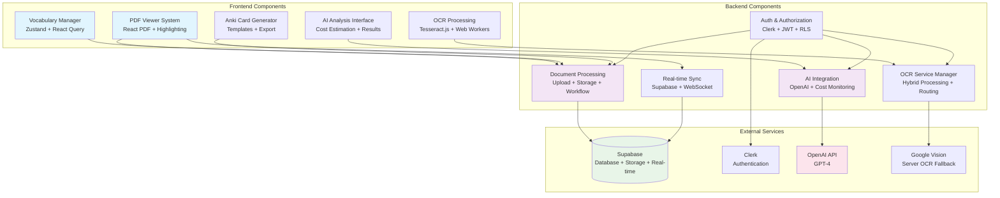

# Components

Based on our architectural patterns, tech stack, and data models, I'll define the major logical components across the fullstack application with clear boundaries and interfaces.

### Frontend Components

#### PDF Viewer Component System
**Responsibility:** Handles PDF rendering, text selection, highlighting, and user interaction within documents

**Key Interfaces:**
- `PDFViewerProps` - Document loading and page navigation
- `HighlightManager` - Text selection and highlight persistence
- `AnnotationLayer` - Overlay rendering for highlights and notes

**Dependencies:** React PDF, Tesseract.js OCR engine, Supabase real-time subscriptions

**Technology Stack:** React PDF 7.5+, Canvas API for highlighting, Web Workers for OCR processing

#### OCR Processing Component
**Responsibility:** Client-side text extraction from PDF pages with progress tracking and quality assessment

**Key Interfaces:**
- `OCREngine` - Tesseract.js wrapper with Japanese language pack
- `OCRWorker` - Web Worker for non-blocking text extraction
- `QualityAssessment` - Confidence scoring and fallback routing

**Dependencies:** Tesseract.js, PDF.js for page rendering, Canvas API for image processing

**Technology Stack:** Tesseract.js 5.0+, Web Workers API, Canvas ImageData processing

#### Vocabulary Management System
**Responsibility:** Personal vocabulary bank with search, categorization, and study progress tracking

**Key Interfaces:**
- `VocabularyStore` - Zustand state management for vocabulary operations
- `StudyTracker` - Learning progress and spaced repetition logic
- `VocabularyAPI` - Backend integration for CRUD operations

**Dependencies:** Zustand state management, React Query for caching, Supabase real-time updates

**Technology Stack:** Zustand 4.4+, React Query for server state, shadcn/ui components

#### AI Analysis Interface
**Responsibility:** User interface for AI-powered vocabulary extraction with cost estimation and result review

**Key Interfaces:**
- `AnalysisConfig` - User preferences for analysis type and scope
- `TokenEstimator` - Cost calculation before processing
- `ResultReviewer` - AI suggestions with user approval workflow

**Dependencies:** OpenAI API integration, cost monitoring service, result caching

**Technology Stack:** React Hook Form for configuration, shadcn/ui dialogs, React Query for API calls

#### Anki Card Generator
**Responsibility:** Flashcard creation, customization, and export functionality with multiple card templates

**Key Interfaces:**
- `CardTemplate` - Different Anki card formats (vocabulary, reading, context)
- `BulkGenerator` - Batch card creation from vocabulary or AI results
- `AnkiExporter` - .apkg file generation and download

**Dependencies:** Anki export library, file download API, card template engine

**Technology Stack:** Custom Anki export utilities, File API, React DnD for card organization

### Backend Components

#### Document Processing Service
**Responsibility:** PDF upload handling, storage management, and processing workflow orchestration

**Key Interfaces:**
- `FileUploadHandler` - Multipart form processing with validation
- `StorageManager` - Supabase Storage integration with security rules
- `ProcessingOrchestrator` - Async workflow coordination for OCR and AI

**Dependencies:** Supabase Storage, file validation utilities, workflow engine

**Technology Stack:** Next.js API routes, Supabase Storage SDK, file type validation

#### OCR Service Manager
**Responsibility:** Hybrid OCR processing with intelligent routing between client-side and server-side engines

**Key Interfaces:**
- `OCRRouter` - Quality-based routing logic for optimal processing
- `ServerOCRFallback` - Google Vision API integration for complex documents
- `ResultAggregator` - Combining and validating OCR results

**Dependencies:** Google Vision API, confidence scoring algorithms, result caching

**Technology Stack:** Google Cloud Vision API, Redis for caching, confidence algorithms

#### AI Integration Service
**Responsibility:** OpenAI API integration with cost monitoring, prompt optimization, and result processing

**Key Interfaces:**
- `PromptEngine` - Optimized prompts for Japanese vocabulary extraction
- `TokenMonitor` - Usage tracking and cost calculation
- `ResultProcessor` - Structured data extraction from AI responses

**Dependencies:** OpenAI API, usage monitoring database, prompt templates

**Technology Stack:** OpenAI SDK, custom prompt templates, usage analytics

#### Authentication & Authorization Layer
**Responsibility:** User authentication, session management, and data access control

**Key Interfaces:**
- `ClerkIntegration` - User authentication and profile management
- `AuthMiddleware` - JWT token validation for API routes
- `PermissionManager` - Row-level security enforcement

**Dependencies:** Clerk authentication service, JWT validation, Supabase RLS policies

**Technology Stack:** Clerk SDK, JWT verification, Supabase Row Level Security

#### Real-time Synchronization Service
**Responsibility:** Live updates for document processing status, highlights, and collaborative features

**Key Interfaces:**
- `RealtimeManager` - Supabase real-time subscription management
- `EventBroadcaster` - Processing status updates and notifications
- `SyncResolver` - Conflict resolution for concurrent updates

**Dependencies:** Supabase real-time APIs, event broadcasting, conflict resolution

**Technology Stack:** Supabase Real-time, WebSocket connections, event-driven architecture

### Component Integration Diagram

### Component Communication Patterns

#### Frontend-Backend Communication
- **API-First Design**: All frontend components communicate through well-defined REST endpoints
- **Real-time Updates**: Supabase subscriptions provide live status updates for long-running operations
- **Optimistic Updates**: Frontend components update UI immediately with server confirmation
- **Error Handling**: Standardized error boundaries with user-friendly fallback states

#### Inter-Component Dependencies
- **Shared State Management**: Zustand stores provide centralized state for vocabulary and document data
- **Event-Driven Architecture**: Components communicate through custom events for loose coupling
- **Service Layer**: Backend components use service layer pattern for business logic separation
- **Dependency Injection**: Components receive dependencies through props/parameters for testability

#### Data Flow Patterns
- **Unidirectional Data Flow**: React components follow top-down data flow with callback props
- **Server State Synchronization**: React Query manages server state with automatic caching and invalidation
- **Real-time Synchronization**: Supabase real-time subscriptions update local state automatically
- **Offline Resilience**: Service workers cache critical functionality for offline OCR processing

---

