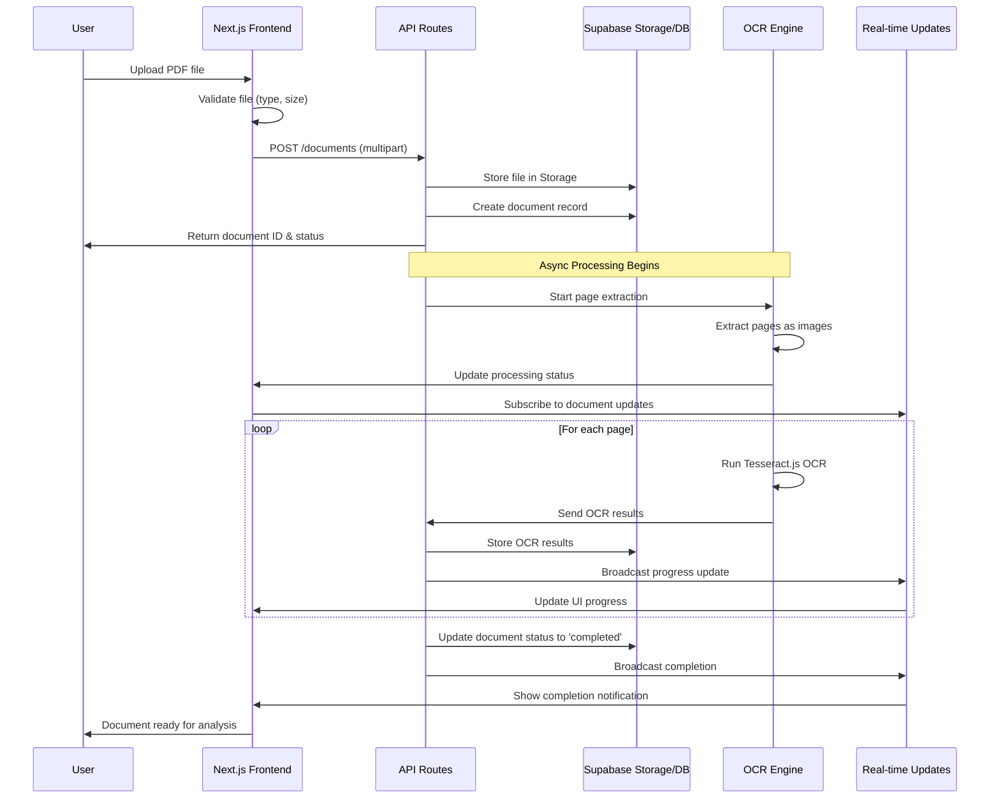
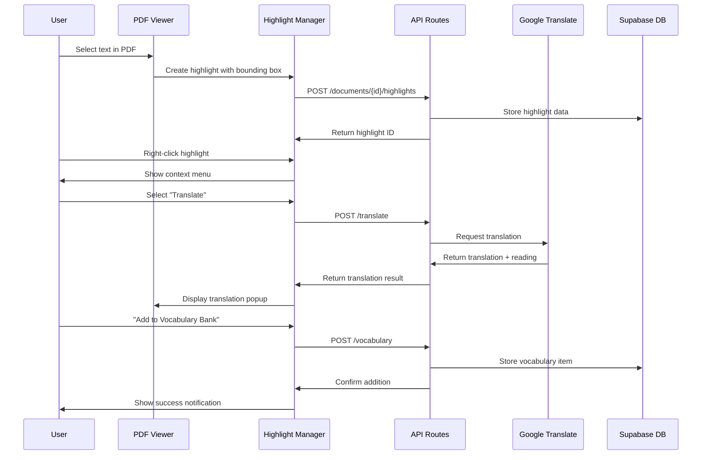
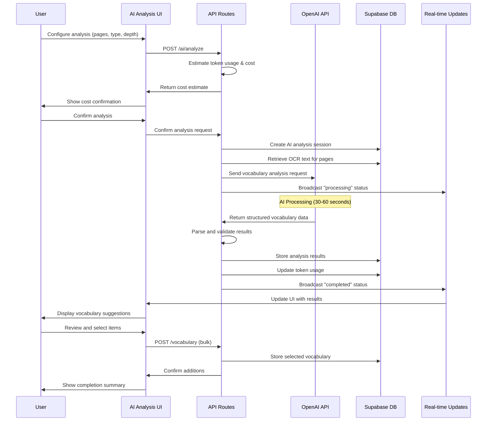
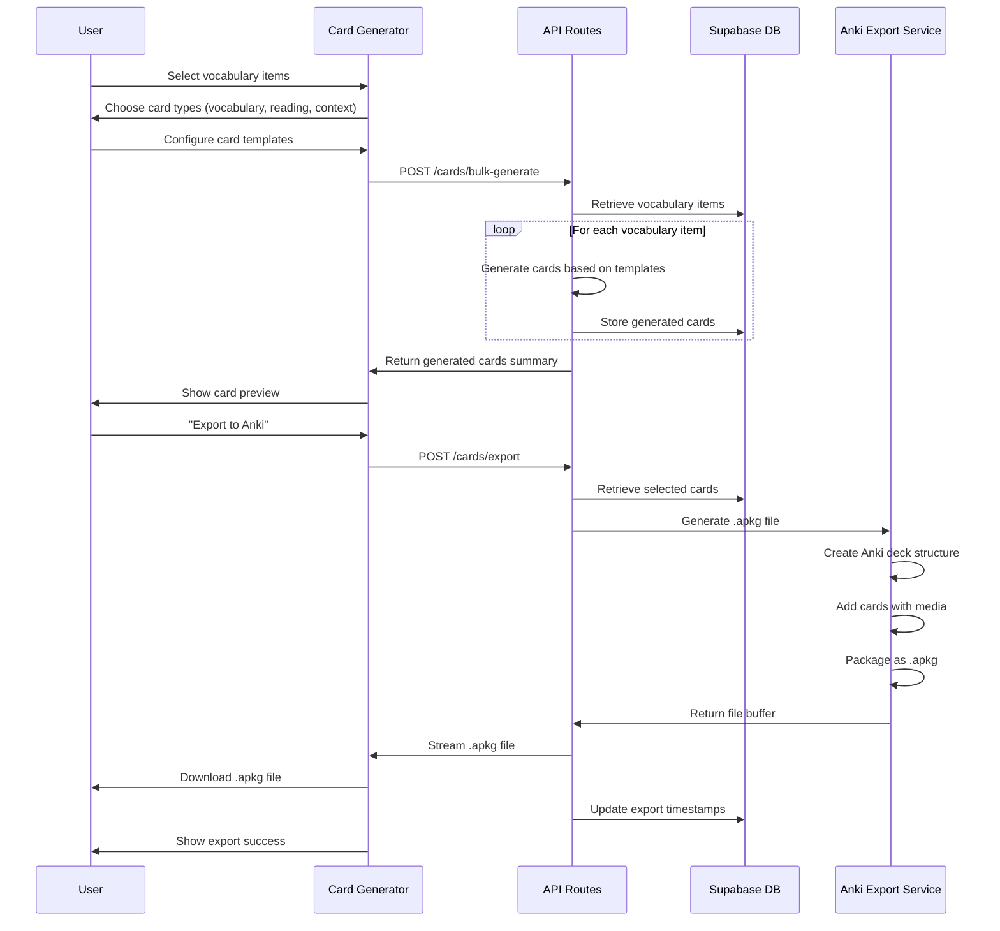
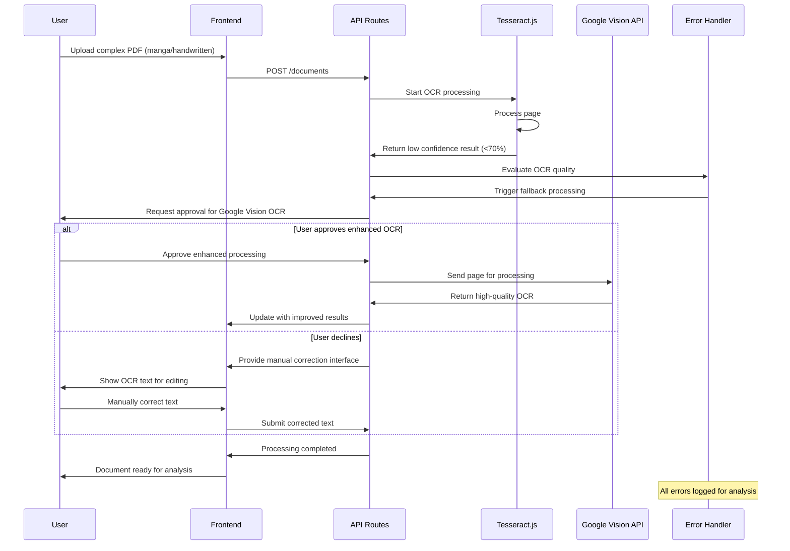

# Core Workflows

These sequence diagrams illustrate the critical user journeys and system interactions that define the PDF-to-Anki Japanese Learning Tool's core functionality.

### Workflow 1: Document Upload and Initial Processing

### Workflow 2: Interactive PDF Reading with Highlighting and Translation

### Workflow 3: AI-Powered Vocabulary Analysis

### Workflow 4: Anki Card Generation and Export

### Workflow 5: Error Handling and Fallback Processing

### Workflow Performance and Error Handling Patterns

**Async Processing Patterns:**
- Long-running operations (OCR, AI analysis) use job queues with status polling
- Real-time updates provide immediate feedback without blocking UI
- Progressive loading shows partial results as they become available
- Background processing continues even if user navigates away

**Error Recovery Strategies:**
- Automatic retry with exponential backoff for transient failures
- Graceful degradation when external services are unavailable
- User-friendly error messages with actionable next steps
- Comprehensive error logging for debugging and monitoring

**Performance Optimizations:**
- Parallel processing for multi-page documents
- Caching at multiple layers (browser, CDN, database)
- Optimistic updates for immediate UI feedback
- Lazy loading for large vocabulary banks and document collections

**Security Considerations:**
- All API calls authenticated with Clerk JWT tokens
- Row-level security ensures users only access their data
- File uploads validated for type, size, and content safety
- External API keys secured in environment variables with rotation

---

**Document Status:** In Progress - Sections 1-8 Complete  
**Next Sections:** Database Schema  
**Stakeholders:** Development Team, Product Owner, Japanese Language Learning Community

---

*This architecture document provides a comprehensive foundation for developing the PDF-to-Anki Japanese Learning Tool from hackathon concept to production application. The stakeholder analysis and risk assessment ensure alignment with user needs while maintaining technical excellence.*
