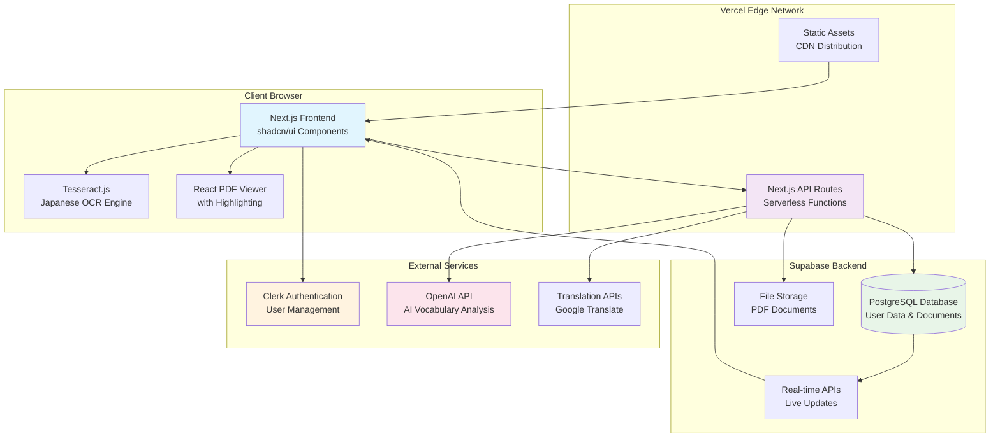

# High Level Architecture

### Technical Summary

The PDF-to-Anki Japanese Learning Tool employs a **modern JAMstack architecture** with **hybrid client-server processing** deployed on Vercel's edge network. The frontend leverages Next.js 14 with App Router for optimal performance, while the backend utilizes Next.js API routes for seamless full-stack integration. **Client-side OCR processing** via Tesseract.js minimizes operational costs while **server-side AI integration** with OpenAI provides intelligent vocabulary extraction. The architecture prioritizes **cost efficiency** through free OCR and strategic use of serverless functions, while maintaining **production scalability** through Supabase's managed database and Clerk's authentication services. This design achieves the PRD's primary goal of reducing vocabulary card creation time from 45 minutes to under 10 minutes through intelligent automation.

### Platform and Infrastructure Choice

**Platform:** Vercel (Frontend) + Supabase (Backend Services) + Clerk (Authentication)

**Key Services:** 
- Vercel Edge Functions for API routes
- Supabase PostgreSQL for data persistence
- Supabase Storage for PDF file management
- Clerk for user authentication and session management
- OpenAI API for AI-powered vocabulary extraction
- Google Translate API for real-time translation

**Deployment Host and Regions:** Vercel Global Edge Network (automatic), Supabase US-West region (configurable)

**Rationale:** This combination provides the fastest development velocity, lowest operational costs, and automatic scaling. Vercel's Next.js optimization, combined with Supabase's comprehensive backend services, eliminates infrastructure management while maintaining production-grade reliability.

### Repository Structure

**Structure:** Monorepo with Next.js full-stack application  
**Monorepo Tool:** Not required - using Next.js built-in full-stack capabilities  
**Package Organization:** Single Next.js application with clear separation between frontend components, API routes, and shared utilities

**Rationale:** For a hackathon-to-production application with tightly coupled frontend and backend, a single Next.js repository provides the fastest development experience. The shared TypeScript interfaces between client and server eliminate API contract mismatches.

### High Level Architecture Diagram

### Architectural Patterns

- **JAMstack Architecture:** Static site generation with serverless APIs - _Rationale:_ Optimal performance, cost efficiency, and automatic scaling for content-heavy learning applications
- **Component-Based UI:** Reusable React components with shadcn/ui design system - _Rationale:_ Consistent design language, accessibility compliance, and rapid development
- **Repository Pattern:** Abstract data access through Supabase client - _Rationale:_ Database independence and testability while leveraging Supabase's real-time features
- **API-First Design:** RESTful API routes with TypeScript contracts - _Rationale:_ Clear separation of concerns and future mobile app compatibility
- **Progressive Enhancement:** Client-side OCR with server-side fallback capabilities - _Rationale:_ Balance between cost efficiency and reliability for complex documents
- **Event-Driven Processing:** Async document processing with real-time status updates - _Rationale:_ Non-blocking user experience during lengthy OCR operations
- **Micro-Frontend Approach:** Modular component architecture within single application - _Rationale:_ Team scalability and feature isolation without microservice complexity

---

